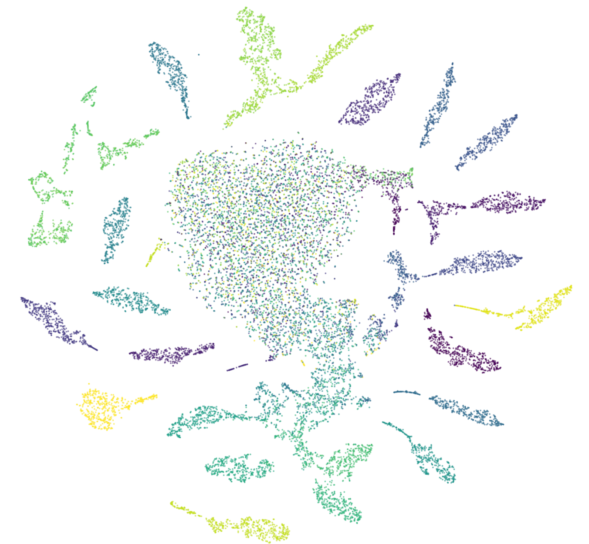

# Introduction

The code in this repository is part of the hands-on tutorial portion of GSI Technology's Gemini APU Workshop.

The workshop is composed of the following parts:
1. Explore The RF Signal Dataset
2. Train A Deep Learning-based RF Signal Vectorizer
3. Vectorize An RF Signal Dataset
3. Implement KNN-based Similarity Search For RF Signal Identification Using Gemini

The following instructions will detail how to install and run the workshop components.

# Explore the RF Signal Dataset

In this part of the workshop, participants will learn:
* basic python programming
* basic use of jupyter notebooks
* some exploratory data analysis and visualization skills
* loading and visualizing the RF Signal dataset

## Prerequisites

You will need a machine with the following installed:
* python3
* jupyter notebook support 
* the Google Cloud Platform (GCP) command line utilities

## Installation

Follow these installation steps:

* Clone this repository to your machine:

```>> git clone https://github.com/gosha1128/gemini_workshop.git```

* Use the GCP tools to download the dataset to your machine:

```>> gsutil -m cp -r gs://deepsignal//gemini_workshop .```

## Run The Notebook

To run the notebook, follow these steps:

* cd into the notebook's directory in the repo:

```>> cd notebooks/ExploreTheRFSignalDataset```

* Launch the notebook server via the run_jupyter.sh script with path to the dataset:

```>> ./run_jupyter.sh  /path/to/dataset```

* The script will output the URL you should use.  Browse to that location in your favorite browser.  You will land in the jupyter environment.  Choose the "ExploreTheRFSignalDataset" notebook in the left hand pane to launch it.  Follow the directions inside the notebook.

# Train A Deep Learning-based Signal Vectorizer

In this part of the workshop, participants will learn:
* use TensorFlow/Keras to train a model that vectorizes raw RF signals

## Prerequisites

For this part of the workshop, you will need:
* a machine with a browser
* a Google Colaboratory account

## Run The Notebook

[ TBD ]

# Vectorize An RF Signal Dataset

In this part of the workshop, participants will learn:
* use TensorFlow/Keras to vectorize an RF signal dataset

## Prerequisites

For this part of the workshop, you will need:
* a machine with a browser
* a Google Colaboratory account

## Run The Notebook

[ TBD ]

# Implement KNN-based Similarity Search For RF Signal Identification Using Gemini

In this part of the workshop, participants will learn:
* build a similarity search database of RF signal fingerprints
* apply KNN to query signals for RF signal identification
* use the Gemini Python API

## Prerequisites

* An Ubuntu Linux 18.04 machine with Python3.6 installed
* the Google Cloud Platform (GCP) command line utilities
* An attached Leda-G board ( it should have already passed at least 1 iteration of dev_diagnostics and you should know its local ip address )
* Gemini Software version=100.9.10.2-rc and GNLPY=00.17.00 ( these are provided via the "gemini_eval_100.9.10.2-rc" package, please see the notebooks/GeminiKNN/run_jupyter.sh script to see/change the installation directories. )

## Installation

Follow these installation steps:

* Clone this repository to your machine:

```>> git clone https://github.com/gosha1128/gemini_workshop.git```

* If you haven't done so already, use the GCP tools to download the dataset to your machine:

```>> gsutil -m cp -r gs://deepsignal//gemini_workshop .```

## Run The Notebook

To run the notebook, follow these steps:

* cd into the notebook's directory in the repo:

```>> cd notebooks/GeminiKNN```

* Launch the notebook server via the run_jupyter.sh script with path to the dataset:

```>> ./run_jupyter.sh  /path/to/dataset```

* The script will output the URL you should use.  Browse to that location in your favorite browser.  You will land in the jupyter environment.  Choose the "GeminiKNN" notebook in the left hand pane to launch it.  Follow the directions inside the notebook.


